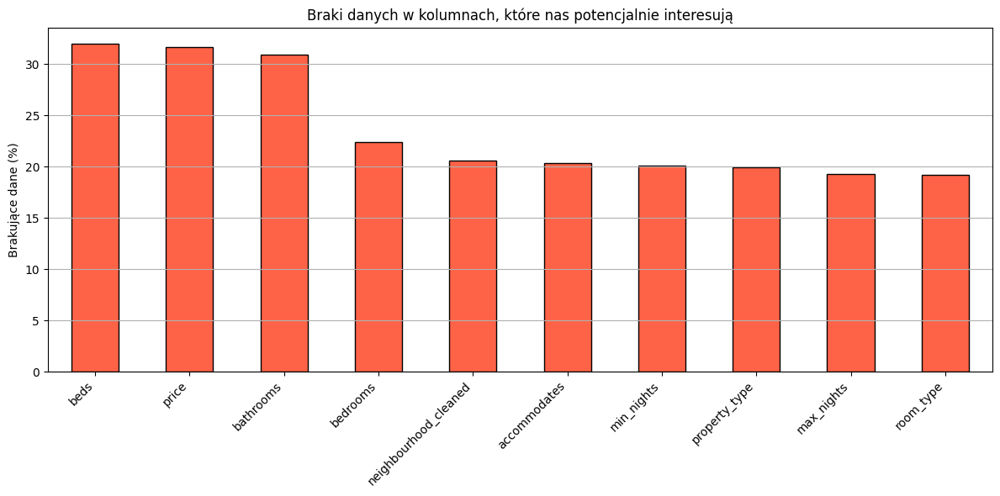

## Analiza nowych danych

Analiza powstała na podstawie notebook'u o nazwie `IUM_etap1_etap2_na_danych_V2.ipynb`

Otrzymane nowe dane są wyższej jakości — zawierają mniej braków, a niektóre kolumny przyjmują teraz bardziej sensowne wartości (np. kolumna oznaczająca liczbę łazienek nie zawiera już wartości niecałkowitych).

Zależności pomiędzy atrybutami a zmienną celu nie uległy znaczącej zmianie w porównaniu do poprzedniego zbioru, co jest dobrą wiadomością — oznacza to, że dotychczasowe modele opierały się na prawidłowych wzorcach.

Jeśli zauważyliśmy jakiekolwiek zmiany w rozkładach cech (np. w przypadku zmiennej price), to miały one charakter naturalny i wynikały głównie z faktu, że nowy zbiór danych jest znacznie większy. Dzięki temu mamy dokładniejszy i pełniejszy obraz rzeczywistych wartości.

## Braki w danych

Przed:

 

Po:

 

W nowych danych mamy procentowo mniej braków oraz trzykrotnie większy zbiór, dzięki czemu dysponujemy większą liczbą danych do analizy.

## Porównanie zmiennej celu `price`

### Tabela statystyk opisowych

Przed:

 

Po:

 

Statystyki opisowe price w dużej mierze pozostają podobne, z wyjątkiem wyraźnie wyższej wartości maksymalnej w nowym zbiorze.

### Rozkład zmiennej price

Przed:

 

Po:

## Analiza jak zmieniły się nasze modele

Początkowo wszystkie nasze modele zwracały znacznie gorsze wyniki niż wcześniej. Wynikało to z faktu, że wraz z nowymi danymi otrzymaliśmy również większą liczbę skrajnych wartości zmiennej price. Zmianę tę szczególnie było widać w błędzie RMSE, który silnie reaguje na duże błędy predykcji.

Aby rzetelnie porównać modele, zdecydowaliśmy się ograniczyć zbiór testowy do danych, dla których price nie przekracza 95. percentyla, aby uzyskać bardziej reprezentatywną ocenę modelu. Dla uczciwego porównania dokonaliśmy tego samego ograniczenia także w przypadku starych danych.

Uważamy, że odrzucenie skrajnych wartości przy ocenie jakości modelu jest dobrym podejściem - w praktyce znacznie istotniejsze jest to, by model dobrze radził sobie w typowych przypadkach, a niekoniecznie dla ekstremalnych, rzadkich obserwacji.

### Wyniki na zbiorze testowym ograniczonym do 95. percentyla zmiennej price

Na starych danych:

| Model              | MAE     | RMSE    |
| ------------------ | ------- | ------- |
| Model naiwny       | 1363.40 | 1783.48 |
| Model bazowy       | 2067.66 | 2783.78 |
| Model zaawansowany | 1164.47 | 1655.83 |

Na nowych danych:

| Model              | MAE     | RMSE    |
| ------------------ | ------- | ------- |
| Model naiwny       | 1315.04 | 1826.12 |
| Model bazowy       | 1713.31 | 2641.19 |
| Model zaawansowany | 1051.03 | 1606.03 |

## Wnioski

Zaobserwowaliśmy nieznaczny wzrost jakości predykcji po przetrenowaniu modelu na nowych, liczniejszych i lepszej jakości danych.
Co prawda błędy MAE i RMSE uległy poprawie, jednak skala poprawy była mniejsza niż oczekiwaliśmy. Najprawdopodobniej wynika to z faktu, że mierzone korelacje pomiędzy atrybutami, jak również ich rozkłady, nie uległy istotnym zmianom, a więc już w starszym, mniejszym zbiorze danych dobrze widoczne były główne zależności.

Można więc wnioskować, że niewielka poprawa jakości i zwiększenie liczby danych przełożyła się na niewielkie, ale zauważalne polepszenie predykcji.
