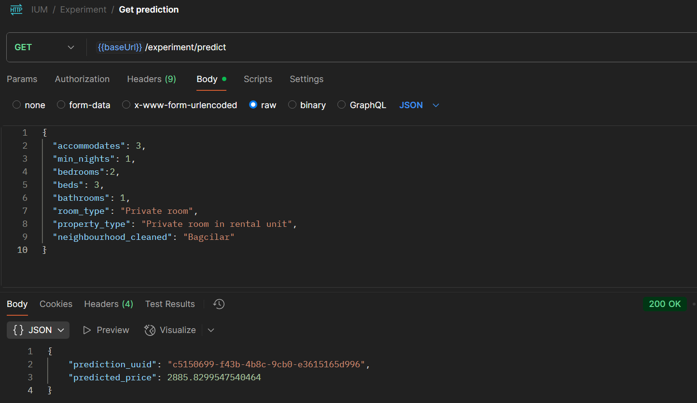
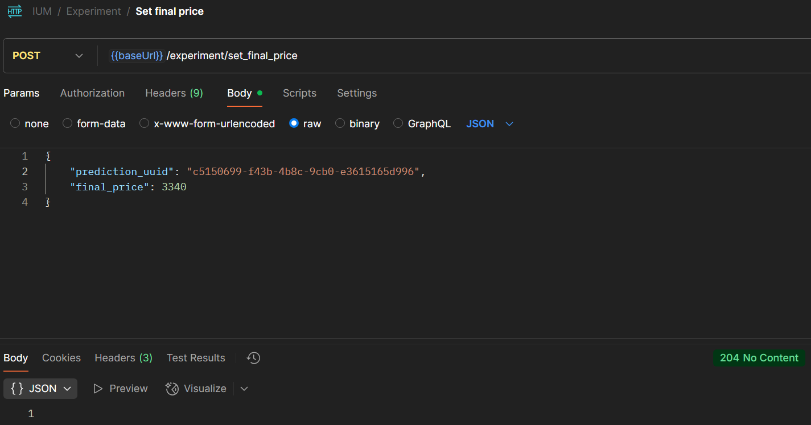
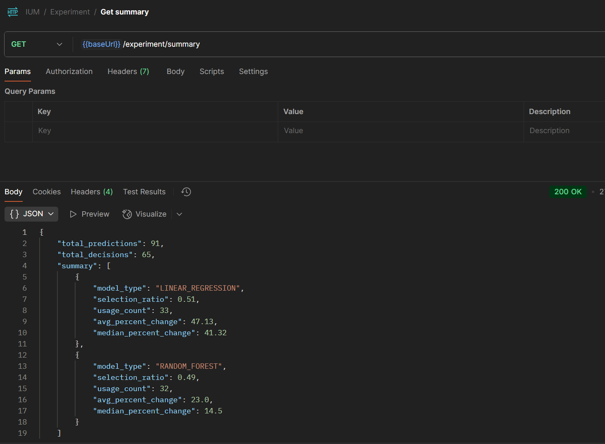
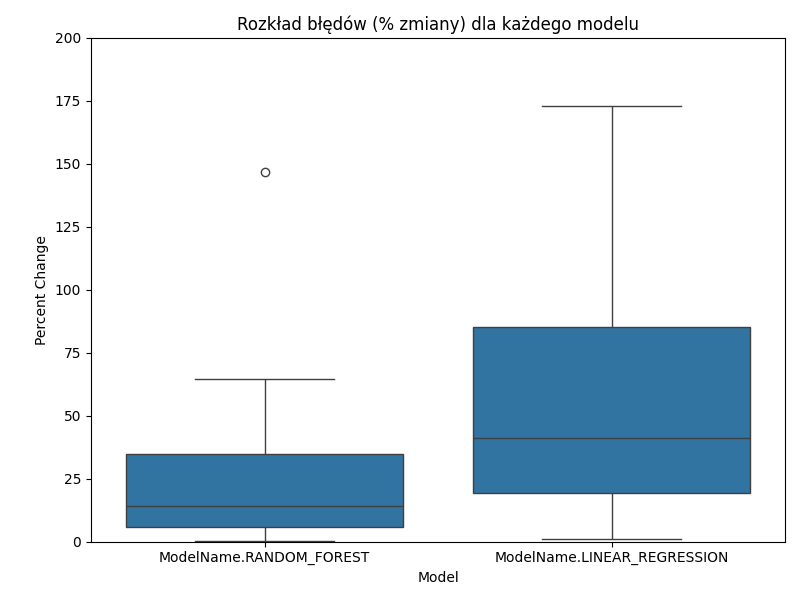
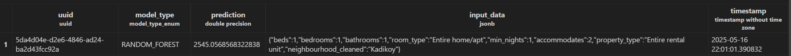
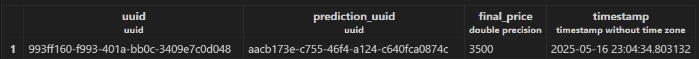

## Eksperyment A/B

W ramach kolejnego etapu projektu naszym zadaniem było umożliwienie przeprowadzenia eksperymentu A/B,
który pozwala porównać jakość działania dwóch modeli predykcyjnych:
modelu bazowego (`Linear Regression`) oraz modelu zaawansowanego (`Random Forest`).

Dzięki temu możliwe było sprawdzenie, jak oba modele radzą sobie w warunkach produkcyjnych
oraz który z nich generuje bardziej trafne i stabilne predykcje.

### Mikroserwis

W celu przeprowadzenia eksperymentu A/B przygotowaliśmy prosty mikroserwis,
który obsługuje proces serwowania predykcji oraz zapisywania wyników potrzebnych do analizy.

Na początku zaimplementowaliśmy endpointy do testowego serwowania predykcji
z trzech modeli (`dummy, base, advanced`), aby upewnić się,
że modele są poprawnie deserializowane i zwracają różne wartości predykcji.

Następnie rozszerzyliśmy mikroserwis o właściwe endpointy pozwalające
na przeprowadzenie eksperymentu A/B, w którym predykcja wykonywana jest losowo
jednym z dwóch modeli (`Linear Regression lub Random Forest`),
a następnie zapisywana wraz z informacją o ostatecznej decyzji cenowej.

### Jak krok po kroku przeprowadzić eksperyment A/B?

Zasymulowaliśmy przeprowadzanie eksperymentu A/B przy użyciu `Postmana` w następujący sposób:

1. Wysłanie żądania, aby uzyskać predykcję z losowo wybranego modelu, podając określone zmienne wejściowe w ciele żądania,

 

2. Wysłanie żądania, aby ustawić ostateczną cenę, podając identyfikator wcześniej uzyskanej predykcji,

 

3. Powrót do kroku 1, jeśli potrzebujemy zebrać więcej danych,

 

4. Wysłanie żądania, aby uzyskać podsumowanie eksperymentu A/B.

### Analiza

Poza wcześniejszym podsumowaniem przygotowaliśmy również prostą wizualizację
wyników sztucznego eksperymentu A/B - wykres boxplot,
który pokazuje rozkłady błędów predykcji dla obu modeli.

W przypadku rzeczywistego eksperymentu A/B sprawdzilibyśmy dodatkowo,
czy uzyskane rozkłady błędów dla obu modeli mają charakter normalny,
a także przeprowadzilibyśmy testy statystyczne (np. test t-Studenta),
aby upewnić się, że zaobserwowane różnice w skuteczności modeli nie wynikają z przypadku.

### Przechowywanie danych eksperymentu

Dane z eksperymentu A/B przeechowywane są w dwóch tabelach `Predction` oraz `Decision`

Przykład danych:

- tabela `Predicton`

- tabela `Decision`

