# Poprawki po oddaniu etapu 1

### Trzymanie danych w repozytorium

Uwaga:

```
- dane nie powinny być trzymane w repozytrium ze względu na możliwość otrzymania ogromnych ilości danych, z czym normalne repozytorium po przekroczeniu pewnej granicy sobie nie poradzi
```

Poprawka:

- Usunęliśmy pliki danych z repozytorium

---

## Modelowanie

Uwaga:

```
- ustalone analityczne kryterium sukcesu powinno być jakoś oparte o dostępne dane

(przy wstępnym modelowaniu warto "wrzucić" dane w prosty model i zobaczyć jakie wyniki osiągamy - pozwala to na określenie sensownego baseline'u dla problemu)
```

Poprawka:

### Model naiwny

Zastosowaliśmy model naiwny, który zawsze zwraca ten sam wynik. Zwraca on medianę zmiennej celu (`price`) ze zbioru treningowego, niezależnie od zmiennych wejściowych. Służy jako punkt odniesienia dla oceny skuteczności innych modeli.

Wyniki modelu naiwnego na zbiorze testowym:

- MAE: `1869.46`
- RMSE: `3472.63`

### Model bazowy

Zastosowaliśmy model bazowy, który jest modelem regresji liniowej. Dla zmiennych kategorycznych zastosowaliśmy kodowanie one hot, a zmienne liczbowe zostały przeskalowane.

Wyniki modelu bazowego na zbiorze testowym:

- MAE: `2405.73`
- RMSE: `3299.12`

### Pierwsza wersja modelu zaawansowanego

Z ciekawości przetestowaliśmy również pierwszą wersję bardziej zaawansowanego modelu, który powinien potrafić rozpoznać nieliniowe zależności - zastosowaliśmy regresję Random Forest.

DLa zmiennych kategorycznych zastosowaliśmy kodowanie one hot, a zmienne liczbowe nie zostały przeskalowane.

Wyniki modelu zaawansowanego na zbiorze testowym:

- MAE: `1710.93`
- RMSE: `2672.90`

Wyniki modelu zaawansowanego na zbiorze testowym po lekkich transformacjach danych:

- MAE: `1660.18`
- RMSE: `2649.37`

Wyniki modelu zaawansowanego na zbiorze testowym po lekkich transformacjach danych i dobraniu hiperparametrów:

- MAE: `1627.11`
- RMSE: `2605.14`

Wyniki modelu zawanasowanego na zbiorze testowym po lekkich transformacjach danych, dobraniu hiperparamertów oraz po logarytmowaniu zmiennej celu w środku modelu:

- MAE: `1544.24`
- RMSE: `2685.88`

Wnioski:

Mimo że udało nam się poprawić wyniki dzięki zastosowaniu modelu zaawansowanego, to błąd nadal pozostaje na tyle duży, że trudno mówić o praktycznym zastosowaniu tych predykcji. Może to kwestia ograniczonych danych, a może po prostu nie potrafiliśmy jeszcze wycisnąć z nich tyle, ile by się chciało.

---

### Wątpliwości co do zmiennej celu `price`

Początkowo uznaliśmy, że `price` z pliku `listings.txt` to cena za noc ustalana przez wystawiającego ofertę — pasuje to do kontekstu zadania. Jednak po zastosowaniu pierwszych modeli i późniejszej analizie danych zauważyliśmy, że wartości tej zmiennej są bardzo wysokie. Budzi to nasze wątpliwości: może to cena za kilka nocy, może dane są błędne, a może mamy do czynienia z bardzo luksusowymi ofertami.

Na tym etapie, z braku lepszej opcji, zakładamy roboczo, że `price` to cena za jedną noc.

---

Uwaga:

```
- ustalone kryteria sukcesu - piszecie Państwo o dwóch kryteriach sukcesu, ale nie wiadomo co to za kryteria
- jak porównuje się zaproponowane kryterium sukcesu do modelu naiwnego (zwracającego zawsze taki sam wynik)?
- jakie jest biznesowe kryterium sukcesu?
- jakie jest analityczne kryterium sukcesu?
- jaka jest akceptowalna wartość proponowanej metryki w analitycznym kryterium sukcesu?
```

Poprawka:

#### Analityczne kryterium sukcesu

Jako metrykę oceny jakości predykcji przyjmujemy RMSE (Root Mean Squared Error),
mierzy ona średni błąd predykcji i kładzie większy nacisk na duże odchylenia.

`Za sukces analityczny uznajemy sytuację, w której model osiąga RMSE mniejsze niż model naiwny (4282.36) oraz model bazowy (4071.42)`.

#### Biznesowe kryterium sukcesu

Biznesowe kryterium sukcesu opieramy na wyniku eksperymentu A/B, w którym użytkownicy będą losowo otrzymywać sugerowaną cenę z modelu bazowego lub modelu zaawansowanego.

`Za sukces uznajemy sytuację, w której średnia zmiana ceny wprowadzana przez użytkowników po otrzymaniu sugestii z modelu zaawansowanego jest mniejsza niż w przypadku modelu bazowego, a także gdy średnia modyfikacja ceny nie przekracza 20% względem wartości zaproponowanej przez model zaawansowany`.

---

Uwaga:

```
- jakie (wstępnie) będą dane wejściowe?
```

Poprawka:

Dane, które planujemy wykorzystać jako zeminne wejściowe (features) dla naszego modelu to:

- accommodates - liczba osób, które może pomieścić lokal

- bedrooms, beds - liczba sypialni i łóżek

- room_type, property_type - typ lokalu i rodzaj obiektu

- bathrooms - liczba łazienek

- minumum_nights - minimalna liczba nocy do zarezerwowania

- neighbourhood_cleaned - dzielnica Stambułu, w której znajduje się lokal

---

## Analiza dostarczonych danych

### Rozkłady kluczowych atrybutów

Uwaga:

```
- jak wyglądają rozkłady kluczowych do realizacji projektu atrybutów?

(dla atrybutów dyskretnych można zrobić wykresy słupkowe z liczbą wystąpień, a dla ciągłych wykresy estymowanego rozkładu; w szczególności w drugim przypadku pozwala to na lepsze zrozumienie wartości danych, które pojawiają się w zbiorze)
```

Poprawka:

#### Zmienna bathrooms

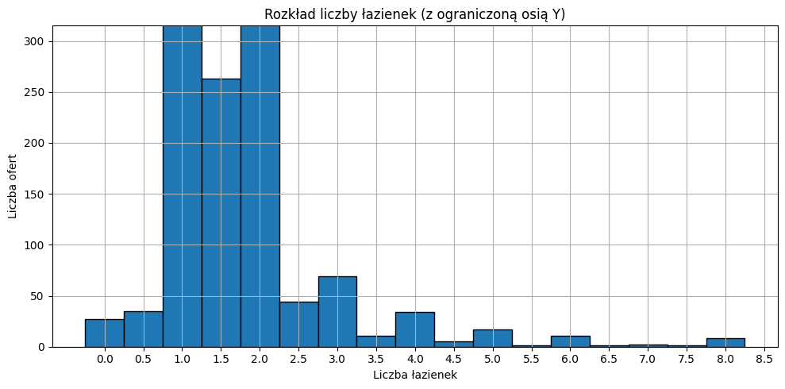

Zmienna bathrooms przyjmuje wartości od 0 do 25 (też **niecałkowite** - co wydaje się problemem). Wartości większe niż 8.5 nie są pokazane na wykresie, ponieważ występują bardzo rzadko i są to pojedyncze przypadki.

#### Zmienna accommodates

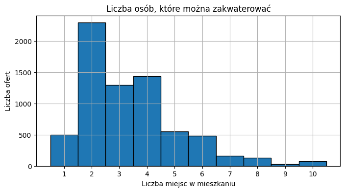

Zmienna accommodates przyjmuje wartośći całkowite od 1 do 16. Wartości większe niż 10 nie są pokazane na wykresie, ale są to znacznie rzadsze przypadki.

#### Zmienna bedrooms

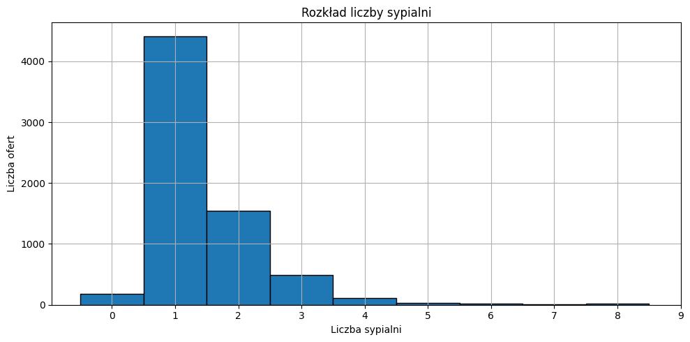

Zmienna bedrooms przyjmuje wartości całkowite od 0 do 49. Wartości większe niz 8 są bardzo rzadkie i nie są pokazane na wykresie.

#### Zmienna beds

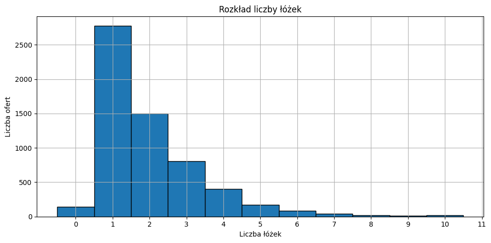

Zmienna beds przyjmuje wartości całkowite od 0 do 50. Wartości większe niż 10 są bardzo rzadkie i nie są pokazane na wykresie.

#### Zmienna room_type

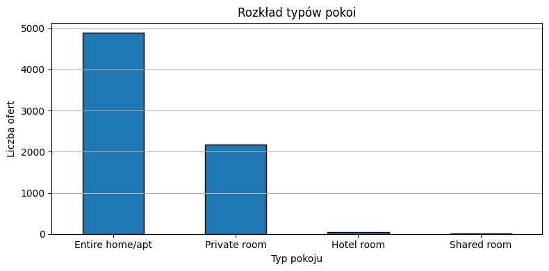

Zmienna room_type przyjmuje tylko 4 wartości pokazane na wykresie.

#### Zmienna property_type

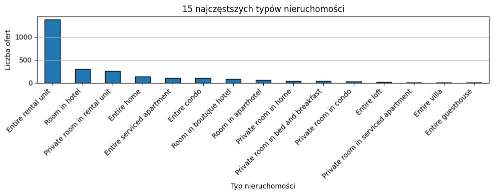

Zmienna property_type przyjmuje 58 unikalnych wartości. Większość z nich pojawia się rzadko i nie są pokazane na wykresie.

#### Zmienna maxiumum_nights

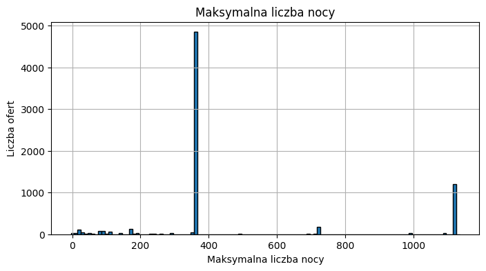

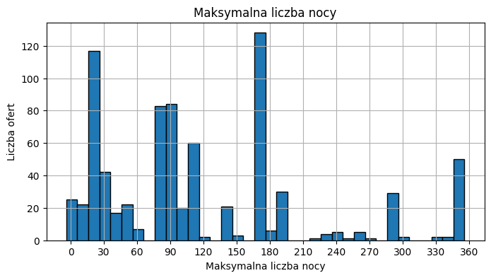

Zerowa maksymalna liczban nocy nie wydaje się być sensowna. Chyba, że jest to taka blokada na rezerwowanie lokalu.

#### Zmienna minimum_nights

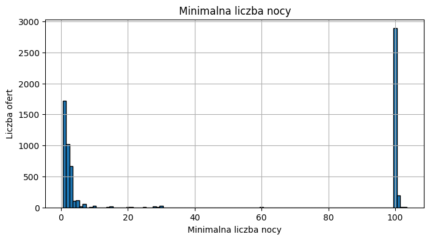

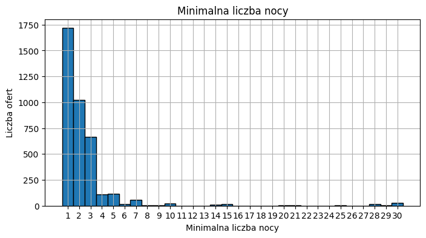

Wartości większe niż 101 są bardzo rzadkie i nie są pokazane na wykresie. Dziwne trochę, że najczęciej występujaca liczba minimalnych nocy to 100 (czyli prawdopodobnie to są długoterminowe oferty).

#### Zmienna neighbourhood_cleaned

Zawiera 39 dzielnic Stambułu.

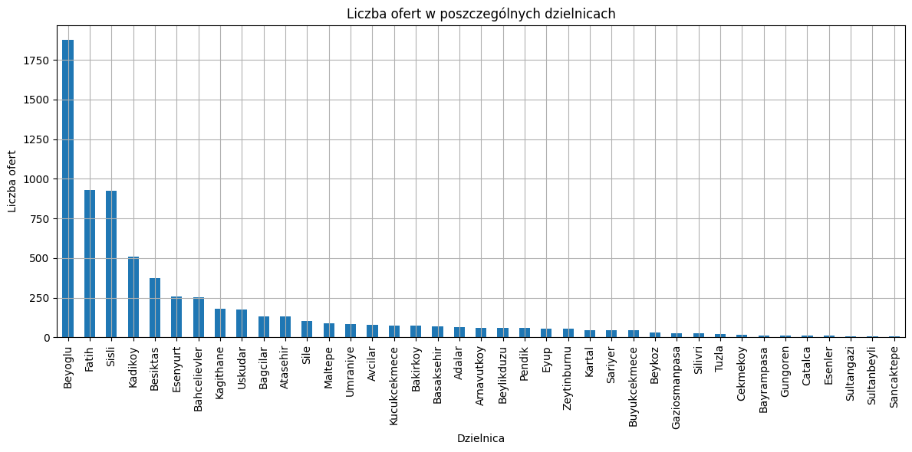

Jak wygląda sytuacja z cenami w poszczególnych dzielnicach?

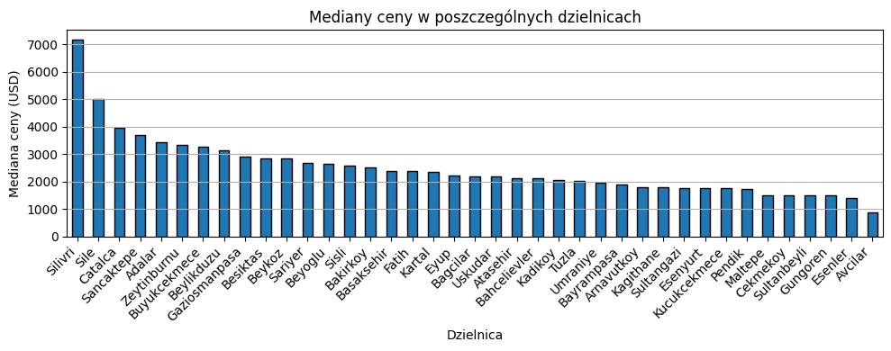

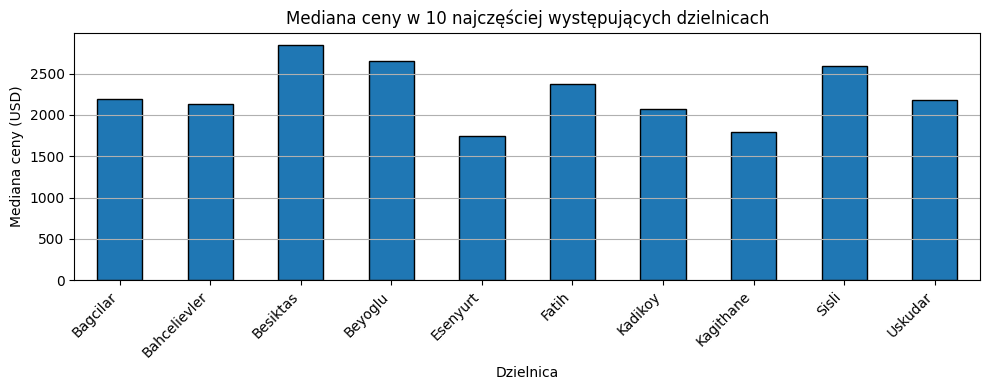

#### Zmienna celu price

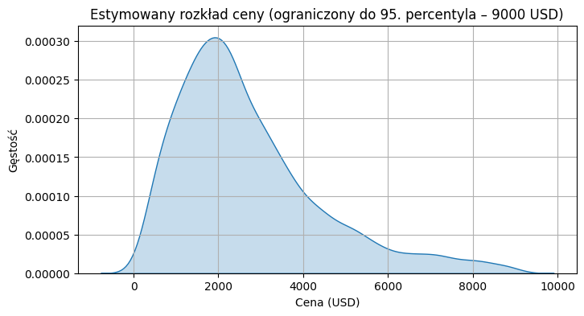

#### Statystyki opisowe

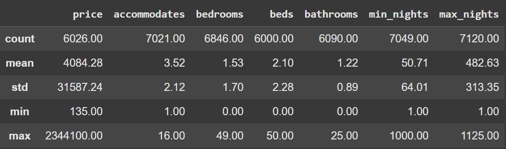

Zmienna price tak jak wcześniej już wspominaliśmy nas niepokoi. Nie dość że ma dziwnie duże wartości, to jeszcze niektóre z nich są skrajnie duże oraz ogólnie różnice między wartoścami są spore. Pokazuje to, że są potencjalne problemy ze zmienną price.

### Dodatkowe zależności

Poniżej pokazujemy pewne zależności w danych, które nas zaniepokoiły w pierwszej iteracji etapu pierwszego, ale wtedy nie pokazaliśmy tego na wykresach.

</br>

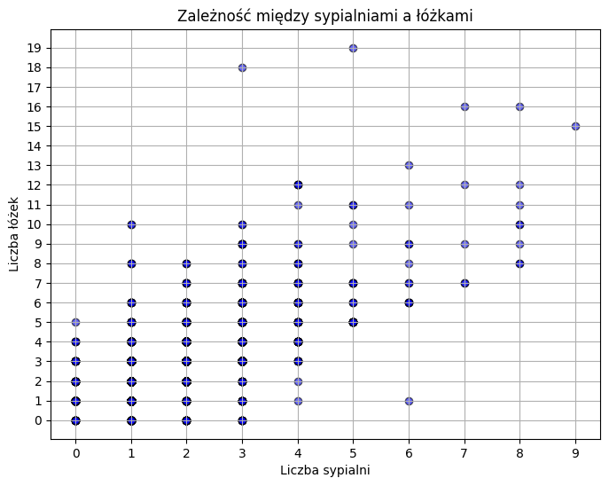

Widać potencjalne problemy, gdy liczba łóżek jest mniejsza niż liczba sypialni oraz, gdy przy zerowej liczbie sypialni mamy niezerową liczbę łóżek.

</br>

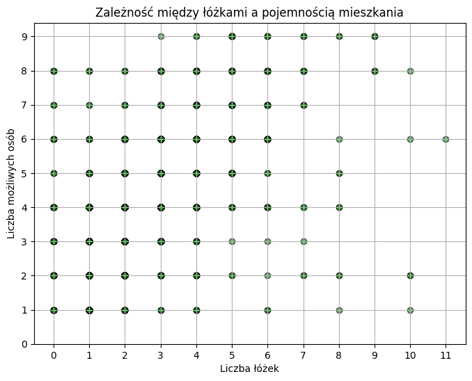

Widać potencjalne problemy, gdy liczba możliwych osób jest mniejsza od liczby łóżek oraz, gdy przy zerowej liczbie łóżek mamy niezerową liczbę osób, które mogą się zmieścić w lokalu.

</br></br>

Kolumna amentities - sprawdziliśmy, że jest 2057 unikalnych wartości. Dlatego zdecydowaliśmy się nie korzystać z tej kolumny, bo wymagałoby to dużo pracy, aby te dane doprowadzić do formy, która by nam odpowiadała.

### Ilość braków

Uwaga:

```
- nie pojawiają się konkretne informacje o ilości braków
```

Poprawka:

We wszystkich dostępnych plikach występuje sporo braków w danych.

W pliku `listings.txt`, który dla nas jest najważniejszy, tak wyglądają braki w danych:

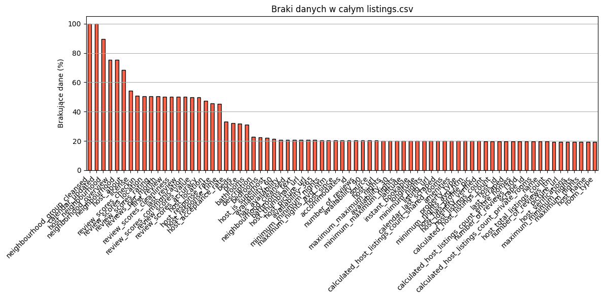

We wszystkich nas interesujących kolumnach występują braki na poziomie większym niż 15%.

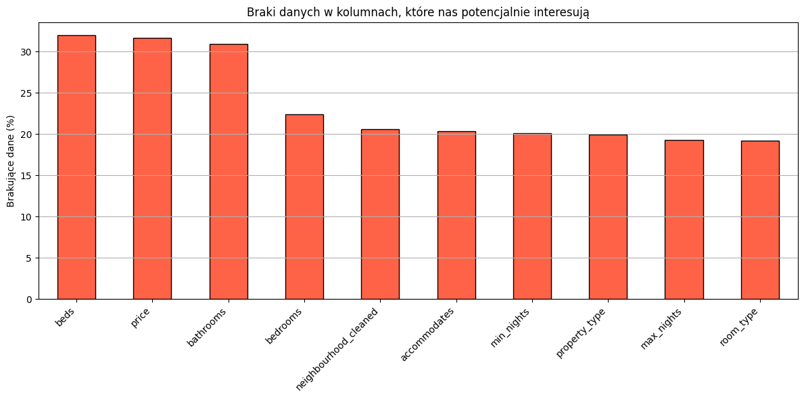

### Zależność między zmiennymi wejściowymi a zmienną celu

Uwaga:

```
- czy jesteście Państwo pewni, że zmienne wejściowe niosą jakąś informację o zmiennej celu?
```

W przypadku zmiennej ciągłej price oraz dyskretnych wartości liczbowych do mierzenia kolelacji użyliśmy `korelacji Spearmana`.

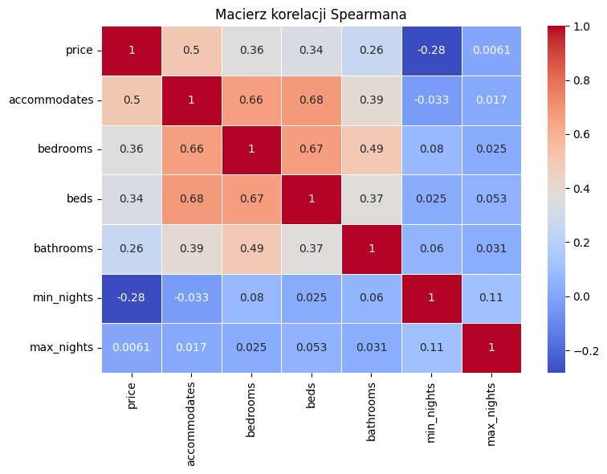

---

W przypadku zmiennej ciągłej price oraz kategorycznych zmiennych wejściowych podzieliliśmy zmienną celu na 20 przedziałów. Dzięki temu obie zmienne przyjmują wartości dyskretne, co pozwala na zastosowanie `współczynnika informacji wzajemnej`.

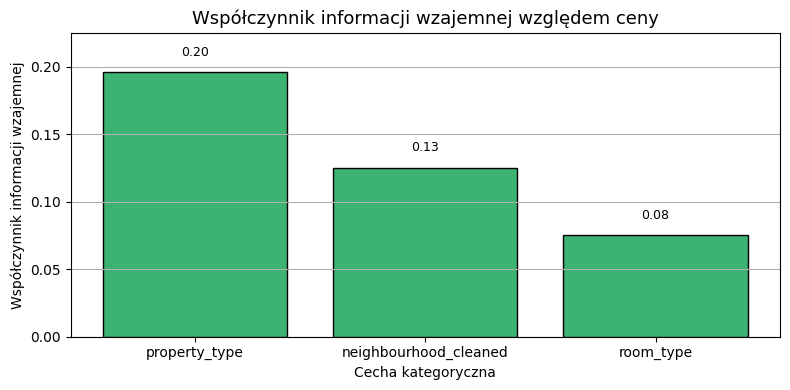

</br>

Atrybuty, które potencjalnie braliśmy pod uwagę, niosą pewną informację względem zmiennej celu. Wyjątkiem jest atrybut `max_nights`, którego nie planujemy używać, biorąc pod uwagę uzyskaną korelację.

## Aktualizacja oceny wykonalności

Ze względu na potencjalne problemy ze zmienną celu (opisane wcześniej - niejasność, dziwne wartości, duże wahania), liczne nieprawidłowości w danych (niespójności, braki, wartości odstające, nielogiczne wartości), a także wyniki uzyskane we wstępnych eksperymentach z różnymi modelami, uważamy, że przy obecnym zestawie danych `nie da się zbudować modelu spełniającego biznesowe kryterium sukcesu`.

Choć udało się poprawić wyniki względem modelu bazowego, przewidujemy trudności w stworzeniu modelu, który byłby praktycznie użyteczny przy obecnych danych.

Uzyskane rezultaty są niezadowalające, a jakość danych wydaje się być głównym ograniczeniem dalszego modelowania.
